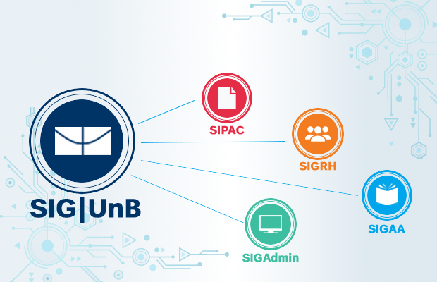

# Tema01 (grupos 1,3 e 4) - Indicadores SIGAA

  

<h1 align="center">Indicadores SIGAA</h1>

 
 
 
 
 
 
 
 
 
## 💻 Objetivos do Projeto
Apresentar um painel com os indicadores do SIGAA para:

  - quantidade de disciplinas ofertadas por curso
  -  quantidade de vagas ofertadas por curso
  - quantidade de alunos matriculados por curso
  - quantidade de salas disponiveis por curso

## 📚 Releases

## ⚙️ Fluxo Organizacional
  Para melhor desenvolvimento do projeto e gestão das atividades foi usado uma metodologia ágil hibrida de Scrum e Kanban.
  Workflow organizado e controlado através das ferramentas de gerenciamento abaixo: 
  
  - Trello:
       -   https://trello.com/b/1nzjxhp4/trabalho

## ✏ Como executar o projeto

### 🧰️ Tecnologias e Ferramentas

### 💿 Instalação 

## 🤝 Contribuição Livre

## 🤓 Desenvolvedores

## 📝 Licença
Este projeto está licenciado sob os termos da licença 
[GNU GPL v3.0](./LICENSE).
